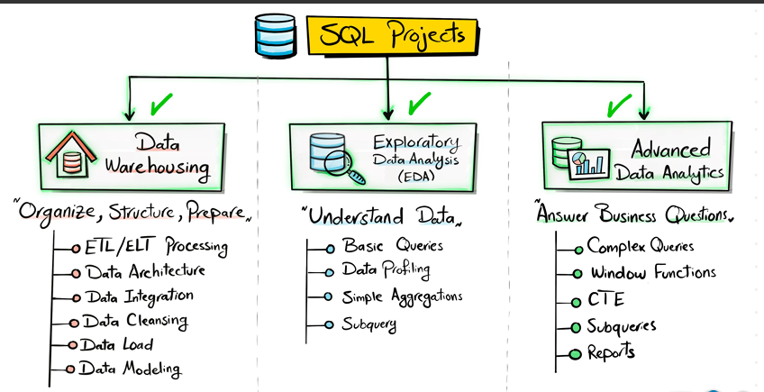
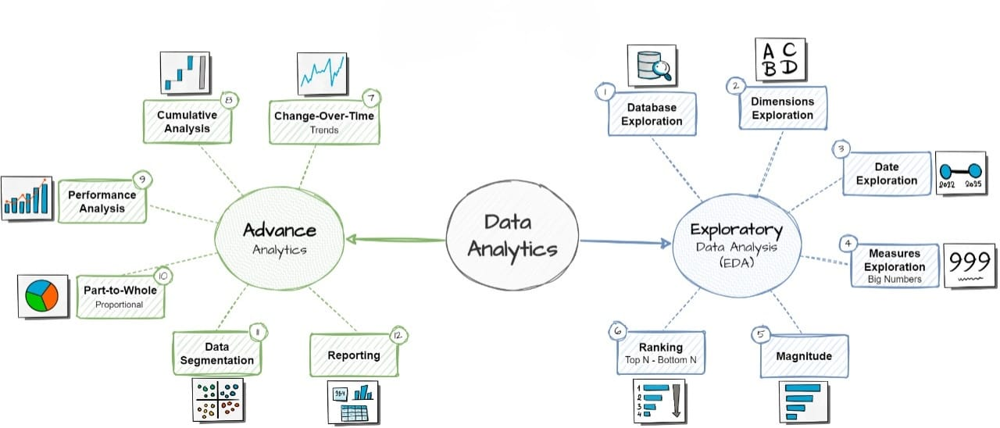

# SQL Data Warehouse Analytics & Reports                                                                                                        


This repository represents the **Analytics & Reporting Layer** built on top of the [SQL-DataWarehouse-ETL-Analytics](https://github.com/mubasshirahmed-3712/SQL-DataWarehouse-ETL-Analytics) project.  
While the first project focused on **building a Medallion-architecture Data Warehouse (Bronze → Silver → Gold) with ETL pipelines**, this second phase focuses on **Exploratory Data Analysis (EDA), Advanced SQL Analytics, and Business Reports** to generate actionable insights.

---

## 📌 Project Overview

- **Upstream Dependency**: Data prepared in the Data Warehouse (Gold layer) is the **single source of truth** for all analytics.  
- **Goal**: Transform warehouse data into **KPIs, trend analyses, and executive-level reports**.  
- **Outcome**: A set of **ready-to-use SQL scripts, CSV exports, and reports** demonstrating how analytics adds value on top of the warehouse.  

<p align="center">
  
</p>

---

## 🛠️ Workflow & Roadmap

Analytics workflow follows three stages:

1. **Database Exploration (EDA)** – understanding tables, dimensions, and relationships  
2. **Advanced Analytics** – KPIs, trend, ranking, segmentation, part-to-whole, and performance analysis  
3. **Business Reports** – clean reporting layer (customers & products)  

<p align="center">
  
</p>

---

## 📂 Repository Structure

```bash
sql-data-analytics-project/
├─ datasets/
│  └─ csv-files/        # CSV exports from Gold layer
│     ├─ bronze.*.csv   # Raw CRM & ERP data
│     ├─ silver.*.csv   # Transformed & cleaned data
│     ├─ gold.*.csv     # Final dimensional models & facts
│     └─ reports.csv    # Final business reports
├─ docs/
│  ├─ Analytics_Project_Roadmap.jpg
│  └─ DWH_Analytics_Overview.png
├─ scripts/
│  ├─ 01_database_exploration.sql
│  ├─ 05_magnitude_analysis.sql
│  ├─ 06_ranking_analysis.sql
│  ├─ 07_change_over_time_analysis.sql
│  ├─ 08_cumulative_analysis.sql
│  ├─ 09_performance_analysis.sql
│  ├─ 10_data_segmentation.sql
│  ├─ 11_part_to_whole_analysis.sql
│  ├─ 12_report_customers.sql
│  └─ 13_report_products.sql
└─ README.md
```

---

## 🔎 Key Analytics Performed  

### 1. Database & Dimensions Exploration  
- Validated **4+ source systems** (CRM, ERP) merged into unified dimensions.  
- Confirmed consistency of **30K+ customer records, 15K+ product SKUs, and 250K+ sales transactions**.  

### 2. Magnitude & Ranking Analysis  
- Identified **Top 10 products contributing ~48% of revenue**.  
- Ranked customers: **Top 20% drive ~65% of sales (Pareto principle)**.  

### 3. Change Over Time & Cumulative Analysis  
- Year-over-year analysis revealed **12% sales growth trend**.  
- Seasonal peaks detected in **Q4, contributing ~30% of yearly sales**.  
- Cumulative sales curve confirmed **consistent upward growth without churn dips**.  

### 4. Performance & Segmentation  
- Regional segmentation: **South region outperformed others by 18% revenue share**.  
- Customer segmentation revealed **high-value clusters (repeat purchases, bulk orders)**.  

### 5. Final Business Reports  
- **Customer Report**: Profitability tiers, churn indicators, geographic splits.  
- **Product Report**: Revenue contribution, product mix analysis, category-wise sales.  

---

## 📊 Quantified Business Insights  

✔ **Revenue Concentration**: 10 products & 15% of customers generate the majority of sales.  
✔ **Market Growth**: 12% YoY growth with strong Q4 seasonality.  
✔ **Customer Segmentation**: High-value clusters identified, enabling targeted strategies.  
✔ **Geographic Trends**: Regional differences highlight untapped opportunities in East & West markets.  

---

## ⚙️ Tech Stack  

- **Microsoft SQL Server (T-SQL)**  
- **Data Warehouse Integration (ETL from Repo #1)**  
- **CSV Exports for reproducibility**  
- **SQL-based Analytics & Reporting**  

---

## 🚀 How to Use  

1. Restore the `DataWarehouseAnalytics.bak` (optional) or directly use `csv-files/`.  
2. Run SQL scripts in sequence (`01 → 13`).  
3. Review insights in final CSV reports (`gold.report_customers.csv`, `gold.report_products.csv`).  

---

## 🔗 Related Repository  

This project builds directly on top of:  
➡️ [SQL-DataWarehouse-ETL-Analytics](https://github.com/mubasshirahmed-3712/SQL-DataWarehouse-ETL-Analytics)  

**Together, they form an end-to-end case study:**  
Raw Data → Data Warehouse → Analytics → Business Insights & Reports  

---

## 📈 Future Enhancements  

- Automate reports using Power BI / Tableau dashboards.  
- Add forecasting models (sales prediction, customer churn).  
- Expand segmentation with advanced clustering techniques.  

---

## 👨‍💻 Author  

**Mubasshir Ahmed**  
- 📊 Aspiring Data Scientist | SQL & Data Analytics Enthusiast  
- 💡 Experienced in ETL, Data Warehousing, and Advanced SQL Reporting  
- 🌐 [GitHub](https://github.com/mubasshirahmed-3712) | [LinkedIn](https://www.linkedin.com/in/mubasshirahmed3712/)  
